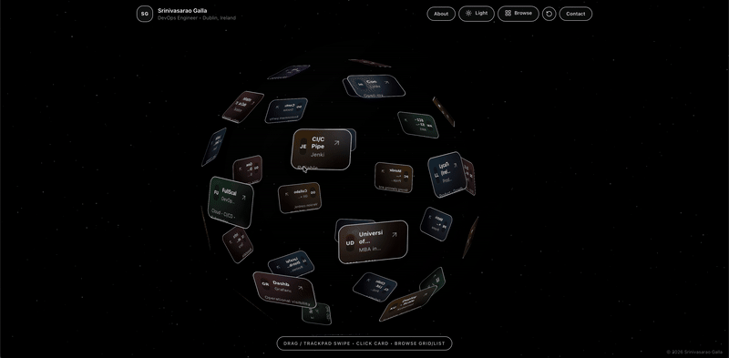

# Srinivasarao Galla Portfolio — www.sgalla.ie 🌍✨

[](https://vitejs.dev/)
[](https://react.dev/)
[](https://tailwindcss.com/)
[](https://www.framer.com/motion/)
[](https://vercel.com/)

[](https://aws.amazon.com/)
[](https://kubernetes.io/)
[](https://www.docker.com/)
[](https://www.terraform.io/)
[](https://www.jenkins.io/)
[](https://prometheus.io/)
[](https://grafana.com/)


An **interactive DevOps portfolio** built around a **3D rotating globe**, showcasing experience, skills, education, and contact links — enhanced with **smooth animations**, **starfield + meteors**, and a **premium UI**.

---

## 🌐 Live Demo

 👉  **https://www.sgalla.ie**
 
(Deployed on Vercel)

---
## 🎥 Preview




> Screen recording of the interactive globe, card popups, browse view, and theme toggle.
---

## ✨ Features

- 🌍 **3D Transparent Globe** with cards wrapped around the surface  
- 🧭 **Smooth rotation** (drag, touch, trackpad friendly)  
- 🪐 **Starfield & meteor animations** for depth and atmosphere  
- 🌓 **Dark mode + Light mode toggle**  
- 🗂️ **Browse mode** with Grid & List views  
- 🪟 **Rich modal popups** for Experience, Skills, Education & Links  
- 📱 **Mobile-optimized mode** for stability and performance  
- 🎯 **Business-focused storytelling** for recruiters and employers  

---

## 🧰 Tech Stack

- **React + Vite**
- **Tailwind CSS**
- **Framer Motion**
- **Lucide Icons**
- **Canvas API** (starfield & meteors)

---

## 🚀 Getting Started

### Install dependencies
```bash
npm install
````

### Run locally

```bash
npm run dev
```

Then open:

```
http://localhost:5173/
```

### Build for production

```bash
npm run build
npm run preview
```

---

## 📁 Project Structure

```txt
.
├─ index.html
├─ public/
│  └─ preview.gif          # Screen recording used in README
├─ src/
│  ├─ App.jsx              # Main globe + UI logic
│  ├─ main.jsx             # React entry point
│  └─ index.css            # Tailwind + small custom styles
├─ tailwind.config.js
├─ postcss.config.js
└─ package.json
```

---

## 🛠️ Customization

All portfolio content lives in **`src/App.jsx`**, including:

* About Me
* Experience timeline
* Skills
* Education
* Social & contact links

The globe, card sizes, and mobile behavior are all configurable from the same file.

---

## ☁️ Deployment

This project is deployed using **Vercel**:

* Framework: **Vite**
* Build command: `npm run build`
* Output directory: `dist`

---

## 📜 License

This is a **personal portfolio project**.
If you wish to reuse or adapt it, please credit:

**© Srinivasarao Galla — [www.sgalla.ie](http://www.sgalla.ie)**

---

## 📬 Contact

- **Website:** https://www.sgalla.ie  
- **LinkedIn:** https://www.linkedin.com/in/sgalla/
- **GitHub:** https://github.com/srinugalla
- **Email:** srinu.galla@gmail.com
